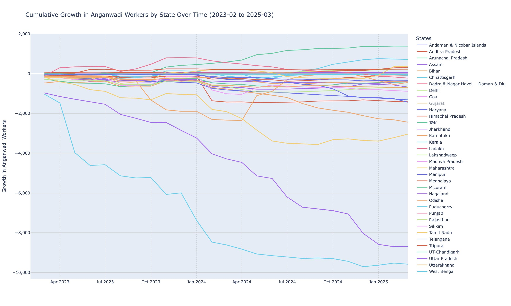

# poshan-tracker

> Information about Beneficiaries, AWCs and State Machineries.

Source: https://www.poshantracker.in/statistics

Poshan Tracker is a mobile-based application for dynamic identification of stunting, wasting, and under-weight prevalence among children and last-mile tracking of nutrition service delivery. Continuing the journey of creating the finest ecosystem for the eradication of malnutrition in India, the program is being invested with data quality indicators, and compatible for scalability.

## Updates

Reference: [Related thread on X (Twitter)](https://x.com/aiforhealth_xyz/status/1913661540492054721)

Below is one of the visuals from the analysis comparing the growth of Anganwadi Workers by state over the years.

